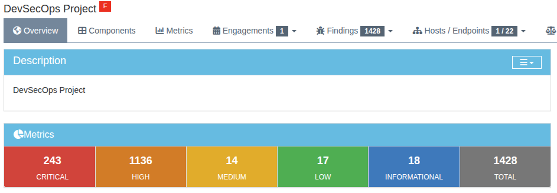

# 🛡️ Pipelines de Seguridad (SAST y DAST)

## 🏗️ Workflows Implementados

1. **`.github/workflows/static-analysis.yml`** - Análisis de seguridad estático
2. **`.github/workflows/deploy.yml`** - Despliegue automatizado en Heroku
3. **`.github/workflows/dynamic-analysis.yml`** - Análisis de seguridad dinámico

---

## 🔍 Análisis Estático de Seguridad (SAST)

### Overview

El análisis estático se ejecuta en **cada push a master** e incluye múltiples herramientas especializadas que analizan diferentes aspectos de seguridad del código y dependencias.

**1. Gitleaks - Detección de Secretos:** Identificar credenciales, API keys y secretos expuestos en el código fuente.

**2. Snyk - Software Composition Analysis (SCA):** Análisis de vulnerabilidades en dependencias de terceros.

**3. Semgrep - Static Application Security Testing:** Análisis estático del código fuente para identificar vulnerabilidades de seguridad.

**4. Trivy - Container Security Scanning:** Análisis de vulnerabilidades en im�genes Docker.

---

## 🚀 Despliegue Automatizado

### Configuración del Deployment

**Trigger**: Se ejecuta automáticamente al completar el análisis estático, independientemente de su resultado.

**⚠️ Configuración de Laboratorio**: En este proyecto, por tratarse de un entorno de laboratorio educativo, se permite el despliegue incluso si el análisis estático detecta vulnerabilidades. Esto facilita probar todo el flujo completo hasta las pruebas dinámicas.

**Para entornos productivos**, se recomienda agregar la condición de éxito:

```yaml
jobs:
  deploy-heroku:
    name: Deploy Heroku
    runs-on: ubuntu-latest
    if: ${{ github.event.workflow_run.conclusion == 'success' }} # Agregar esta línea
```

**Características**:

- **Plataforma**: Heroku Container Registry
- **Método**: Docker deployment
- **Prerequisito**: Análisis estático exitoso (en entornos productivos)

---

## 🕵️ Análisis Dinámico de Seguridad (DAST)

### Overview

El análisis dinámico se ejecuta **después del despliegue exitoso** y realiza pruebas de penetración automatizadas contra la aplicación en ejecución.

**1. OWASP ZAP - Dynamic Application Security Testing:** Escaneo completo de vulnerabilidades web en tiempo de ejecución.

**2. Nuclei - Vulnerability Scanner:** Escaneo rápido con templates especializados de vulnerabilidades.

---

## 📊 Gestión Centralizada de Vulnerabilidades

Todos los resultados de los escaneos son enviados automáticamente a DefectDojo para centralizar la gestión del ciclo de vida de vulnerabilidades detectadas.



---

### Referencias de Herramientas Utilizadas

- [Gitleaks](https://github.com/zricethezav/gitleaks) - Secret Detection
- [Snyk](https://snyk.io/) - Software Composition Analysis
- [Semgrep](https://semgrep.dev/) - Static Analysis
- [Trivy](https://trivy.dev/) - Container Security
- [OWASP ZAP](https://owasp.org/www-project-zap/) - Dynamic Analysis
- [Nuclei](https://nuclei.projectdiscovery.io/) - Vulnerability Scanner
- [DefectDojo](https://defectdojo.org/) - Vulnerability Management
